# Content
1. [Introduction](#introduction)
2. [Client & Server in MCP](#client--server-in-mcp)
3. [Architecture](#architecture)
    - [Primitives](#primitives)
    - [Layers](#layers)
        - [Data Layer with JSON-RPC](#1-data-layer)
        - [Transport layer](#2-transport-layer)
4. [Lifecycle Management](#lifecycle-management)
5. [ Creating MCP Server & MCP Inspector](#creating-mcp-server)
6. [Tools in MCP Server](#tools-in-mcp-server)
7. [Resources](#resources)
8. [Prompt](#prompt)
9. [How to connect local MCP server with LLM](#how-to-connect-local-mcp-server-with-llm)

---

# Introduction
MCP (Model Context Protocol) is an open-source standard for connecting AI applications to external systems.

Using MCP, AI applications like Claude or ChatGPT can connect to data sources (e.g. local files, databases), tools (e.g. search engines, calculators) and workflows (e.g. specialized prompts)—enabling them to access key information and perform tasks.

Think of MCP like a USB-C port for AI applications. Just as USB-C provides a standardized way to connect electronic devices, MCP provides a standardized way to connect AI applications to external systems.

MCP is a stateful protocol as it maintain session during communication
> MCP maintains only basic session info by default (like the session ID and connection transport), but to make it fully stateful (with useful context like user data or history), you must add your own storage.
 

### Example
Before MCP:
- Every AI tool integration was custom
- Different APIs, different formats
- Hard to reuse tools across models

Example:
```
GPT → custom JSON → GitHub tool
Claude → different JSON → same GitHub tool
```
> Same tool, rewritten again and again.

After MCP:
- One standard protocol
- Any AI model can connect to any MCP-compatible tool
- Plug-and-play tools 

```
AI Model  →  MCP Server  →  Tools / Data / APIs
```

### MCP standardizes:
1. How tools are described (name, inputs, outputs)
2. How AI calls tools
3. How tools respond
4. Context sharing between model and tools

### What an MCP Server Does
An MCP Server:
1. Advertises tools (what it can do)
2. Accepts tool calls from AI
3. Validates input
4. Executes real logic
5. Returns structured output

### MCP vs Tool Calling

#### 1. What is MCP and Tool / Function Calling?
Tool / Function Calling
- The LLM is trained to output a JSON structure
- Your app parses it
- Your app executes the function
- The result is sent back to the model

MCP\
protocol that defines:
- How tools are discovered
- How they are called
- How results are returned
- How context is maintained

#### 2. Key Architectural Difference
Tool Calling
```
AI Model → JSON → Your App → Tool Logic
```
MCP
```
AI Model → MCP Protocol → MCP Server → Tool Logic
```


[Go To Top](#content)

---
# Client & Server in MCP
MCP Client = the AI side\
MCP Server = the execution side

### What is the Client in MCP?
The client is:
- The AI model or
- The agent framework (LangChain, LangGraph, custom agent)

What the MCP client does
- Connects to an MCP server
- Discovers available tools
- Decides which tool to call
- Sends tool arguments
- Uses the response to continue reasoning
> Client THINKS, not WORKS

### What is the Server in MCP?
The server is:
- A running service (Node.js / Python / etc.)
- That exposes tools
- And executes real-world logic

What the MCP server does
- Stores API keys & secrets
- Talks to external APIs
- Reads databases / files
- Handles errors, retries, caching
- Returns structured results
> Server WORKS, not THINKS

### Server does the Heavy Lifting
All complex, risky, and resource-intensive work is done on the server — not by the AI model / MCP client.

The client only:
- Decides what to do
- Not how to do it

#### Example WITHOUT “server does the heavy lifting”
Scenario\
User: “Show me open GitHub issues”

Flow (Bad design)
```
AI Model
 ├─ Stores GitHub API key
 ├─ Knows GitHub REST API details
 ├─ Handles pagination
 ├─ Filters issues
 ├─ Handles errors
```
Problems:
- API key exposure
- AI must understand API details
- Logic duplicated per model
- Hard to maintain

### What the MCP Server handles (The “Heavy Lifting”)
1. Authentication & Security
    - Stores API keys
    - Manages permissions
    - Prevents misuse
2. Business Logic   
3. Error Handling & Retries
    - Network failures
    - Rate limits
    - API changes
4. Performance Optimization
    - Caching
    - Batching
    - Throttling

[Go To Top](#content)

---
# Architecture 
MCP follows a client-server architecture where an MCP host — an AI application like `Claude Code` or `Claude Desktop` — establishes connections to one or more MCP servers.

The MCP host accomplishes this by creating one MCP client for each MCP server. Each MCP client maintains a dedicated connection with its corresponding MCP server.

The key participants in the MCP architecture are:
- **MCP Host:** The AI application that coordinates and manages one or multiple MCP clients
- **MCP Client:** A component that maintains a connection to an MCP server and obtains context from an MCP server for the MCP host to use
- **MCP Server:** A program that provides context to MCP clients


## Primitives
MCP primitives are the most important concept within MCP. They define what clients and servers can offer each other.

primitives specify the types of contextual information that can be shared with AI applications and the range of actions that can be performed.

MCP defines three core primitives that servers can expose:
- **Tools:** Executable functions that AI applications can invoke to perform actions (e.g., file operations, API calls, database queries)
- **Resources:** Data sources that provide contextual information to AI applications (e.g., file contents, database records, API responses)
- **Prompts:** Reusable templates that help structure interactions with language models (e.g., system prompts, few-shot examples)

Each primitive type has associated methods for discovery (`*/list`), retrieval (`*/get`), and in some cases, execution (`tools/call`).

- Tools:
    - `tools/list`: Client asks the server: "What tools do you provide?"
    - `tools/call`: CLient tells the server: "Please run this tool with this argument"
- Resources:
    - `resource/list`: Client asks the server: "What resources are available?"
    - `resource/read`: Client say: "Give me the content fo this resources"
    - `resource/subscribe`: Client subscribe or unsubscribe from updates
- Prompts:
    - `prompts/list`: Client asks the server: "What prompts templates do you provide?"
    - `prompt/fetch`: Client fetches the specific prompt template

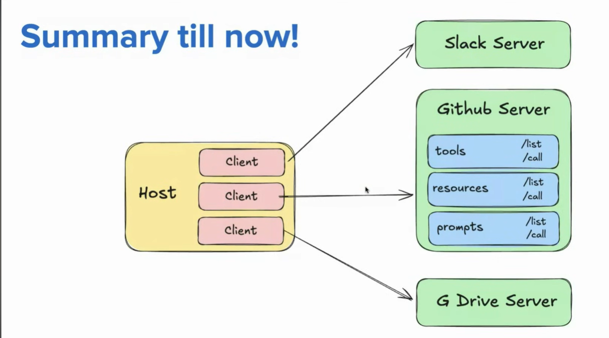

MCP also defines primitives that clients can expose. These primitives allow MCP server authors to build richer interactions.
- **Sampling**: 
    
    Allows servers to request language model completions from the client’s AI application. 
    
    This is useful when servers’ authors want access to a language model, but want to stay model independent and not include a language model SDK in their MCP server. 
    
    They can use the `sampling/complete` method to request a language model completion from the client’s AI application.

- **Elicitation**: 

    Allows servers to request additional information from users.
    
    This is useful when servers’ authors want to get more information from the user, or ask for confirmation of an action. 
    
    They can use the `elicitation/request` method to request additional information from the user.

- **Logging**: 

    Enables servers to send log messages to clients for debugging and monitoring purposes.

## Layers
MCP consists of two layers:
1. [**Data layer:**](#1-data-layer)\
The data layer in MCP is the part of the MCP server responsible for accessing, managing, and serving data (files, databases, logs, documents) to the AI in a safe and structured way.

2. [**Transport layer:**](#2-transport-layer)\
The transport layer in MCP defines how MCP messages are transmitted between the AI client and the MCP server, independent of the tools or logic being executed.


## 1. Data layer:
The data layer in MCP is the part of the MCP server responsible for accessing, managing, and serving data (files, databases, logs, documents) to the AI in a safe and structured way.

It is the language and grammar of the MCP ecosystem that everyone agrees to communicate

It uses JSON-RPC based protocol for client-server communication, including lifecycle management, and core primitives, such as tools, resources, prompts and notifications.

### JSON-RPC
JSON-RPC is a lightweight **remote procedure call** (RPC) protocol that lets a client call methods on a server using JSON messages.

A **Remote Procedure Call** allows a program to execute a function on another computer as if it were local, hiding the details of network communication and data transfer. this abstraction make it easier to build distributed application

**JSON-RPC** combine the concept of remote procedure call with the simplicity of JSON, allowing developer to structure RCP request and response in a standardize JSON format

**Example of JSON-RPC**

Normal function call (local)
```js
add(2, 3)
```
JSON-RPC (remote function call)
```json
{
  "method": "add",
  "params": [2, 3]
}
```

**JSON-RPC Request Structure**
```json
{
  "jsonrpc": "2.0",
  "method": "getUser",
  "params": {
    "id": 101
  },
  "id": 1
}
```
| Field   | Purpose            |
| ------- | ------------------ |
| jsonrpc | Protocol version   |
| method  | Function name      |
| params  | Arguments          |
| id      | Request identifier |

**JSON-RPC Response (Success)**
```json
{
  "jsonrpc": "2.0",
  "result": {
    "name": "Amit",
    "role": "Student"
  },
  "id": 1
}
```
**JSON-RPC Response (Error)**
```json
{
  "jsonrpc": "2.0",
  "error": {
    "code": -32601,
    "message": "Method not found"
  },
  "id": 1
}
```

#### Notifications
A notification is a JSON-RPC message sent by a client or server without expecting any response.

The protocol supports real-time notifications to enable dynamic updates between servers and clients.

For example,\
when a server’s available tools change—such as when new functionality becomes available or existing tools are modified—the server can send tool update notifications to inform connected clients about these changes.

JSON-RPC Notification Format
```json
{
  "jsonrpc": "2.0",
  "method": "log",
  "params": {
    "message": "Tool have been updated"
  }
}
```
Key difference from a normal request
- Normal request
    - Has an `id` 
    - Expects a response
- Notification
    - No `id`
    - No response
## 2. Transport layer
The transport layer manages communication channels and authentication between clients and servers. 

It handles connection establishment, message framing, and secure communication between MCP participants.

MCP supports two transport mechanisms:
- **Stdio transport:** Uses standard input/output streams for direct process communication between local processes on the same machine, providing optimal performance with no network overhead.

- **Streamable HTTP transport:** Uses HTTP POST for client-to-server messages with optional Server-Sent Events for streaming capabilities. This transport enables remote server communication and supports standard HTTP authentication methods including bearer tokens, API keys, and custom headers. MCP recommends using OAuth to obtain authentication tokens.


[Go To Top](#content)

---

# Lifecycle Management
Lifecycle management in MCP is how an MCP client and MCP server start, communicate, maintain state, and shut down safely during an interaction.

#### Illustration
Web app lifecycle
```
Server starts → Request → Process → Response → Close
```
MCP lifecycle
```
Connect → Discover → Execute → Maintain Context → Close
```

MCP Lifecycle Generally occur three phase
1. Initialization Phase
2. Operation Phase
3. Shut down phase

## 1. Initialization Phase
The initialization phase must be the first interaction between client and server

Initialization phase does two main thing:
1. **Establish protocol version compatibility:**\
Make sure both client and server communicate over same version of MCP protocol
    > Client has a list of MCP version he can work with, if server operates on any of those version client connect with the server otherwise does not connect
2. **exchange and negotiate capability:**\
Both client and server shear some basic details  (like available tools, ect.) with each other, adn decide which features will be available during the session


#### Step 1: Send initialize  request
client sends an **initialize** request to sever

> The client should not send any other request (except PING) before the server has responded to this `initialize` request

Example:
```json
{
  "jsonrpc": "2.0",
  "method": "initialize",
  "params": {
    "clientName": "ai-agent",
    "protocolVersion": "2025-03-26"
  },
  "id": 1
}
```
here:
- `"method": "initialize"` -> we car calling `initialize` method on server
- `"protocolVersion": "2025-03-26"` -> MCP protocol version that  client uses
- you can also pass other info if you want like `"clientName": "ai-agent"`
 
#### Step 2: Server respond
in response of clients `initialize` request server respond with sending his own capabilities

Example:
```json
{
    "jsonrpc": "2.0",
    "result": {
        "protocolVersion": "2025-03-26",
        "capabilities":{
            "tools": ["getUserOrders", "readFile"],
            "resources": ["file://docs/*"],
            "prompts": ["summarizeOrders"]
        },
        "serverInfo":{
            "name":"fileSystemServer", 
            "version":"2.5.1"
        },
        "instruction":"Server is ready to accept the command"
    },
    "id": 1
}
```
Here:
- `"protocolVersion": "2025-03-26"` -> MCP protocol version that  server uses
- `"capabilities":{}` -> capabilities of server 
- you may get some extra info like `serverInfo` and `instruction`


#### Step 3: Handshake Complete via notification
After successful initialization, the client must send an `initialized notification` to indicate it is ready to began normal operation

> The server should not send any request (except PING and logging) to client before receiving `initialized notification`

Example:
```json
{
    "jsonrpc": "2.0",
    "method":"notification/initialized"
}
```
Now thw client and sever is connected

## 2. Operation Phase
During operation phase, the client and server exchange the message according to the negotiate capabilities

during message exchange client must:
- Respect the negotiated protocol version
- only use capabilities that were successfully negotiated

#### Capability Discovery
Client learns what server is capable of, like what tools, resources and prompt are available on sever

we use `*/list` to get this info

This request are trigger automatically once the Initialization phase complete successfully and client connect to the server 

Example:
- Client → Server (Tool Discovery Request)

    ```json
    {
      "jsonrpc": "2.0",
      "id": 1,
      "method": "tools/list",
      "params": {}
    }
    ```
- Server → Client (Tool Discovery Response)

    ```json
    {
      "jsonrpc": "2.0",
      "id": 1,
      "result": {
        "tools": [
          {
            "name": "getWeather",
            "description": "Get current weather for a city",
            "inputSchema": {
              "type": "object",
              "properties": {
                "city": {
                  "type": "string",
                  "description": "Name of the city"
                }
              },
              "required": ["city"]
            }
          },
          {
            "name": "calculateSum",
            "description": "Add two numbers",
            "inputSchema": {
              "type": "object",
              "properties": {
                "a": { "type": "number" },
                "b": { "type": "number" }
              },
              "required": ["a", "b"]
            }
          }
        ]
      }
    }
    ```
#### Tool Calling
once client gets the list of all available tool from server it give that list to Host, and it is responsibility of Host to stores that list safely, and map the tool according to users query

client does not know which tool to call Host decide which tool to call with what arguments

we use `tools/call` for tool calling from client to server 

Example:

- user query: what is 5 pluse 10?

- Host decides:
    - Tool: `calculateSum`
    - Arguments: `{ "a" : 5, "b" : 10 }`

- client to server:

    ```json
    {
      "jsonrpc": "2.0",
      "id": 2,
      "method": "tools/call",
      "params": {
        "name": "calculateSum",
        "arguments": {
          "a": 5,
          "b": 10
        }
      }
    }
    ```
- Server → Client

    ```json
    {
      "jsonrpc": "2.0",
      "id": 2,
      "result": {
        "output": 15
      }
    }
    ```
## 3. Shut Down phase
- one side (generally client) initiate the shut down
- No special JSON-RPC shutdown message is need during this phase
- [Transport layer](#2-transport-layer) is responsible for signaling the termination

> server generally does not initiate the shutdown unless there is any technical issue like server crash, ect. 

#### Shut down in STDIO (local server)
client Initiate Shutdown
- client close the input stream to the server and wait for server to exit
- if server does not exit:
    - send `SIGTERM` OS command to terminate the child process where server is up and running
    - if server is still running event after `SIGTERM` client send another OS command `SIGKILL` to kill the child process where server is up and running

Server Initiate shutdown
- server close the output stream for client and exit

#### Shut down in HTTP (remote server)
client Initiate Shutdown
- the client (Host) close the http connections it opened with server 

Server Initiate shutdown
- the server close the http connection form his side
- The client must be prepared to detect a dropped connection and handle it (eg., reconnect if appropriate) 

## Error Handling & Recovery
- Server Returns structured error
- Client adapts reasoning

Example:
```json
{
  "jsonrpc": "2.0",
  "error": {
    "code": -32601,
    "message": "Method not found"
  },
  "id": 4
}
```


[Go To Top](#content)

---
# Creating MCP Server
to create mcp server we need `@modelcontextprotocol/sdk` and `zod`
```bash
npm install @modelcontextprotocol/sdk zod
```
### 1. create the server object
```js
import { McpServer } from "@modelcontextprotocol/sdk/server/mcp.js";

const server = new McpServer();
```
At the time of creating the `McpServer` you must pass the basic info about the server
```js
const server = new McpServer({
    name: "my-mcp-server",
    version: "1.0.0",
    capabilities: {
        tools: {},
        resources: {},
    },
});
```
This object you pass here will be send to client as a response to `initialized` request in [initialization phase of lifecycle](#lifecycle-management)

`capabilities`: 

- this object contains the information about what are you server is capable of.
- It accept `tools`, `prompts`, `resources` with empty object as it just say "i have tools" and not "what tool i have"

#### Just for understanding
when client makes a initialized request
```json
{
  "method": "initialize"
}
```
server respond with
```json
{
  "capabilities": {},
  "serverInfo": {
    "name": "my-mcp-server",
    "version": "1.0.0"
  }
}
```
Note: in response from server we have empty `capabilities` object as he have don't add any tools into our mcp server

### 2. select which transport layer you want to use
The [transport layer](#2-transport-layer) manages communication channels and authentication between clients and servers.

As we are building local MCP server will be using `Stdio transport`
```js
import { StdioServerTransport } from "@modelcontextprotocol/sdk/server/stdio.js";

const transport = new StdioServerTransport()
await server.connect(transport)
```

> Note: for Streamable HTTP transport we have same code but we just need to setup an http server to handle request and response

### 3. MCP Inspector
Just like postmap MCP Inspector is a testing tool for MCP server, to connect this MCP Inspector with MCP server

1. Install the MCP Inspector

    ```bash
    npm install -D @modelcontextprotocol/inspector
    ```
2. add a new script into your `package.json`

    ```json
    {
        "scripts": {
            "start": "node src/index.js",
            "inspect":"npx @modelcontextprotocol/inspector src/index.js"
        },
    }
    ``` 
    Here `src/index.js` the path where we have initialize the MCP sever

now whenever you will run command `npm run inspect` it open following window onto the browser

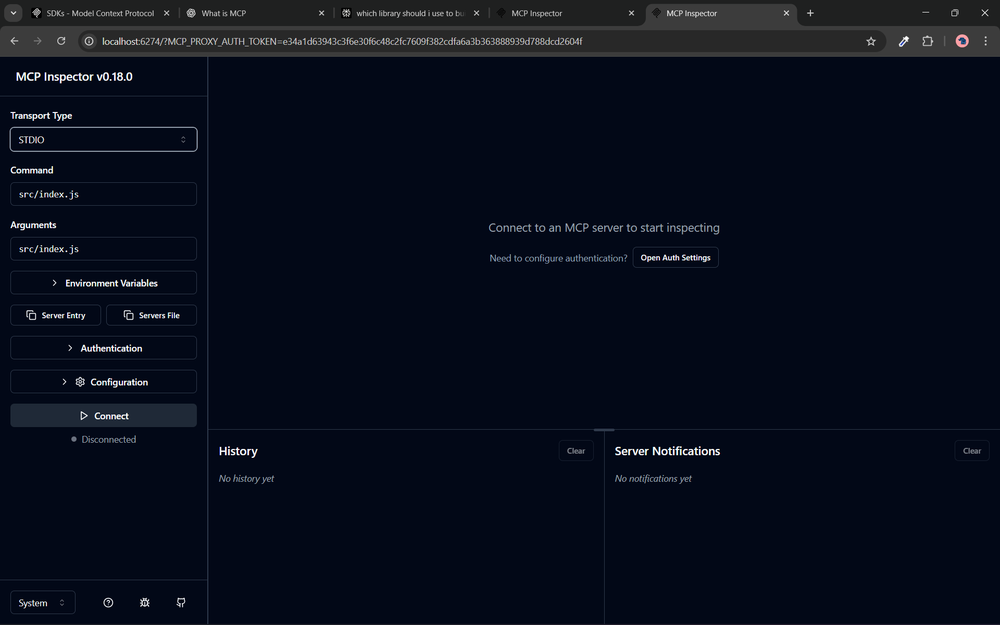

At top left corner you can see the transport type. Select the transport type you initialize your server with, in our case we have STDIO

Then click onto the connect button to connect the MCP server

Once you connect:

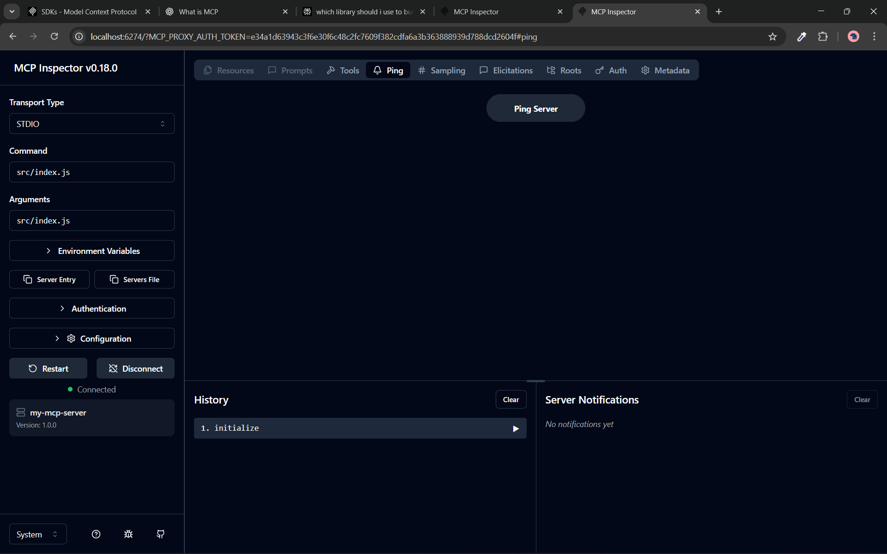

- at the bottom of the sidebar we can see our MCP sever
- At the top we have all the capabilities the server and client can offer to each other\
example: inside tools we will see all the tools the server can offer
- you can directly call any tool from here 
- inside history, we have all the JSON-RPC request and their response
    > as we send `initialize` request to connect with MCP server we see that inside the History section when we connect to server

[Go To Top](#content)

---
# Tools in MCP Server
Tools in an MCP server are executable functions that the server exposes, allowing an AI model to request real operations like reading data, calling services, or performing actions.

### Syntax 1:
```js
.tool(
    "tool_name", 
    "tool_description", 
    {
        input_schema
    }, 
    async_function_to_call
)
```
Example:
```js
const server = new McpServer({...})

server.tool(
    "add",
    "Add two numbers",
    {
        a: z.number(),
        b: z.number(),
    },
    async ({ a, b }) => {
        return {
            sum: a + b
        };
    }
)
```
### Syntax 2:
```js
.registerTool(name, config, handler)
```
Example
```js
server.registerTool(
    "add",
    {
        title: "Add two numbers",
        description: "Add two numbers",
        inputSchema: z.object({
            a: z.number(),
            b: z.number(),
        })
    },
    async ({ a, b }) => {
        return {
            sum: a + b
        };
    }
)
```

From MCP inspector
- Request

    ```json
    {
      "method": "tools/call",
      "params": {
        "name": "add",
        "arguments": {
          "a": 10,
          "b": 5
        },
        "_meta": {
          "progressToken": 0
        }
      }
    }
    ```
- Response

    ```json
    {
      "content": [],
      "value": 15
    }
    ```

### How to use MCP inspector for Tool calling
1. connect your MCP inspector with your MCP sever and go into the tool section from top navigation bar
2. here click onto the list tool

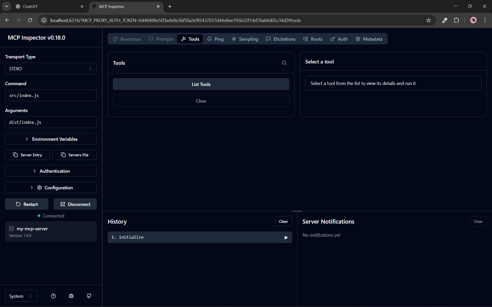

3. Once you click list tool it will make `tools/list` request onto the server, and server will respond with all of his available tools,
which you can see inside the tools section

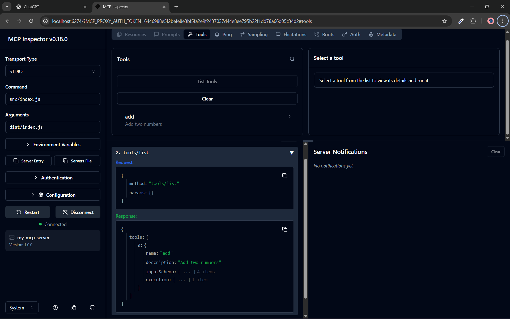

4. Click onto the tool you want to call, then on the right side you'll see a form to provide an input and make `tools/call` request onto the server

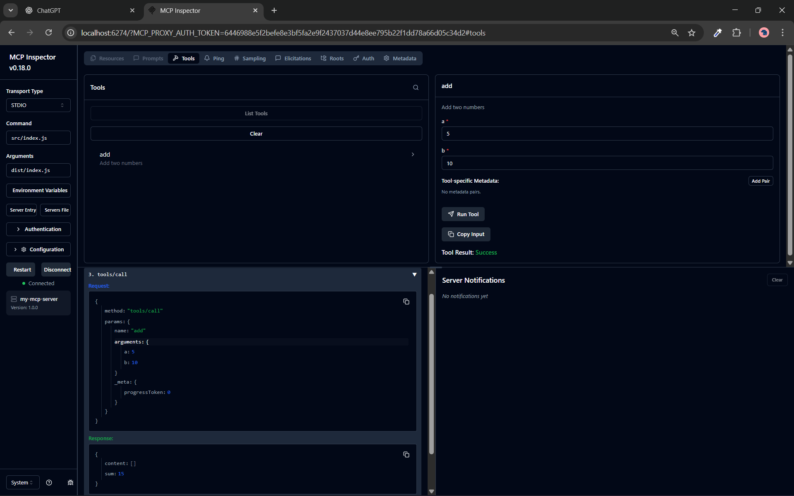

### How to return tool response from MCP server
To return a tool response in MCP, return a JSON object from the tool function — nothing else.

> as MCP follow [JSON-RPC](#json-rpc) you must return some response

#### Example:
```js
server.tool(
    "demo",
    "A demo tool",
    {}, // no input
    async () => {
        return {success:true};
    }
);
```
request:
```json
{
  "method": "tools/call",
  "params": {
    "name": "demo",
    "arguments": {},
    "_meta": {
      "progressToken": 0
    }
  }
}
```
response
```json
{
  "content": [],
  "success": true
}
```
The content array exists because MCP uses one universal message format for everything it sends to a model.

> When you connect your MCP with LLM it read the response from this content array

MCP is not just a tool system.\
It is a messaging protocol between:
- Model
- MCP server
- Clients

So MCP enforces one shape for all messages:
```js
Message {
  content: ContentBlock[]
}
```

#### Why an array specifically?
Because a single response can contain multiple things at once.
Example:
- Some text
- A tool result
- A file reference

```json
{
  "content": [
    { "type": "text", "text": "Here is the result" },
    {
      "type": "tool_result",
      "tool_name": "add",
      "result": { "sum": 15 }
    }
  ]
}
```
#### Analogy you already know (HTTP middleware)
You write:
```js
res.json({ sum: 15 });
```
But internally:
- Headers
- Status
- Body
- Metadata

exist even if you didn’t define them.

content array is similar to this
#### Example:
```js
server.tool(
    "demo",
    "A demo tool",
    {}, // no input
    async () => {
        return {
            content:[{type: "text", text: "Hello, from demo tool!"}]
        };
    }
);
```
request:
```json
{
  "method": "tools/call",
  "params": {
    "name": "demo",
    "arguments": {},
    "_meta": {
      "progressToken": 0
    }
  }
}
```
response
```json
{
  "content": [
    {
      "type": "text",
      "text": "Hello, from demo tool!"
    }
  ]
}
```

### How to handle Content array
contents is a list of typed payloads that an MCP server sends back to the client / LLM.

Each item in contents must be exactly one of these types:

1. TextContent

    ```js
    {
      type: "text",
      text: "plain text or markdown"
    }
    ```
2. BlobContent (JSON, files, binary)

    ```js
    {
      type: "blob",
      blob: "base64-encoded-data",
      mimeType: "application/json"
    }
    ```


Invalid content (common mistake)
```js
{ text: "hello" }           // missing type
{ type: "text", blob: "x"} // wrong field
{ type: "text", mimeType } // mimeType not allowed
```

[Go To Top](#content)

---

# Resources
Resources are passive data sources that provide read-only access to information for context, such as file contents, database schemas, or API documentation.

### syntax:
```js
server.resource(
    name,
    uri,
    metadata,
    handler
);
```
### Example:
```js
server.resource(
    "data",
    "data://data",
    {
        description: "return the array of random number",
        title: "random number",
        mimeType: "application/json",
    },
    async (uri) => {
        return {
            contents: [
                { 
                    uri: uri.href, 
                    text: JSON.stringify([1, 2, 3, 4, 5]), 
                    mimeType: "application/json" 
                }
            ],
        };
    }
);
```
- must return the data warped within `contents` block as resource return data to LLM or client and they can only read through this contents block directly
- URI (Uniform Resource Identifier) is a string that uniquely identifies a resource.
- `uri` must follow the actual `uri` syntax like `"a://b/c/d/..."` 
- Resource is already typed by its URI. So MCP does not require `type`, and instead allows (and prefers) a `uri`.
- `mimeType` (Multipurpose Internet Mail Extensions type) tells the client/LLM what kind of data this content is.

Common main types
| Main Type     | Meaning                   |
| ------------- | ------------------------- |
| `text`        | Human-readable text       |
| `application` | Structured or binary data |
| `image`       | Images                    |
| `audio`       | Audio                     |
| `video`       | Video                     |
| `multipart`   | Mixed content             |


#### Client request
```json
{
  "method": "resources/read",
  "params": {
    "uri": "data://data"
  }
}
```
#### Server Response
```json
{
  "contents": [
    {
      "uri": "data://data",
      "mimeType": "application/json",
      "text": "[1,2,3,4,5]"
    }
  ]
}
```
### Resource Template
A resource template in MCP is a pattern for resource URIs that can contain variables.

#### example
```
"/notes/{id}"
```
- `/notes/{id}` → resource template
- `{id}` → variable
- Matches:
    - `/notes/1`
    - `/notes/42`
    - `/notes/abc`

#### Resource vs Resource Template
| Concept           | Meaning                                              |
| ----------------- | ---------------------------------------------------- |
| Resource          | One concrete URI (`/notes/1`)                        |
| Resource Template | Pattern that produces many resources (`/notes/{id}`) |


#### Client request
```json
{
  "method": "resources/templates/list",
  "params": {}
}
```
#### Server Response
```json
{
  "resourceTemplates": [
    {
      "name": "resource template",
      "title": "return number",
      "uriTemplate": "data://{data}",
      "description": "return the the number user input",
      "mimeType": "application/json"
    }
  ]
}
````

#### Code example
```js
server.resource(
    "resource template",
    new ResourceTemplate("data://{data}",{list:undefined}),
    {
        title: "return number",
        description: "return the the number user input",
        mimeType: "application/json",
    },
    async (uri, {data}) => {
        return {
            contents: [{ uri: uri.href, text: JSON.stringify(data), mimeType: "application/json" }],
        };
    }
)
```
as you can see the code for resource template is same as resource declaration, we just make changes at 2 place only
1. instead of uri we pass `ResourceTemplate` object
2. at handler accept the dynamic resource variable `{data}`


#### Client request
```json
{
  "method": "resources/read",
  "params": {
    "uri": "data://1"
  }
}
```
#### Server Response
```json
{
  "contents": [
    {
      "uri": "data://1",
      "mimeType": "application/json",
      "text": ""1""
    }
  ]
}
````

### ResourceTemplate Object

in above code we can see the following line
```js
new ResourceTemplate("data://{data}",{list:undefined}),
```
it is use to create a dynamic uri for your resource
- `"data://{data}"` is a dynamic uri with dynamic variable `data`
- `list` is a required argument even if it set as undefined
- `list`: it is a callback function that, when implemented, returns all resources matching the template

    Example
    ```js
    new ResourceTemplate("data://{data}", {
        list: async (_extra) => {
            const items = [
                { id: "1", value: 10 },
                { id: "2", value: 20 },
            ];

            return {
                resources: items.map((item) => ({
                    uri: `data://${item.id}`,
                    name: item.id, // required
                    title: `Item ${item.id}`, // optional
                    description: `Value: ${item.value}`,
                    mimeType: "application/json",
                })),
                // nextCursor: undefined,        // add this if you support pagination
            };
        },
    })
    ```
    client request
    ```json
    {
      "method": "resources/list",
      "params": {}
    }
    ```
    > client make `resources/list` and not `resources/templates/list`, i.e it is not listing the templates it listing the normal static resources

    server response:
    ```json
    {
      "resources": [
        {
          "name": "1",
          "title": "Item 1",
          "uri": "data://1",
          "description": "Value: 10",
          "mimeType": "application/json"
        },
        {
          "name": "2",
          "title": "Item 2",
          "uri": "data://2",
          "description": "Value: 20",
          "mimeType": "application/json"
        }
      ]
    }
    ```

#### Beside list it also accept the `complete` callback which is option one
- The complete callbacks are per‑variable autocomplete functions for your URI template.
- For each `{variable}` in the template, you can provide a function that returns suggested values as a string array (optionally async), which the client uses to offer completions.

    Example
    ```js
    new ResourceTemplate("data://{data}", { 
        list:undefined,  
        complete: {
            data: async (value) => {
                if(value == "yes"){
                    return ["op1", "op2"];
                }
            },
        }
    })
    ```
    User/client starts typing a URI like `data://yes`
    - client request

        ```json
        {
          "method": "completion/complete",
          "params": {
            "argument": {
              "name": "data",
              "value": "yes"
            },
            "ref": {
              "type": "ref/resource",
              "uri": "data://{data}"
            },
            "context": {
              "arguments": {}
            }
          }
        }
        ```
    - Server response

        ```json
        {
          "completion": {
            "values": [
              "op1",
              "op2"
            ],
            "total": 2,
            "hasMore": false
          }
        }
        ```

[Go To Top](#content)

---
# Prompt
In Model Context Protocol (MCP), a prompt is:\
A structured, reusable `message template` that a client (like an AI app or agent) can ask your MCP server for.

message template:
```json
{
  "messages": [
    {
      "role": "user",
      "content": {
        "type": "text",
        "text": "hi abc"
      }
    }
  ]
}
```
> this is similar to LangChain massage template

as you return the prompt response it must follow this template

### syntax:
```js
server.prompt(
    name,
    description,
    input_schema,
    handler
);
```

### Coding implementation
```js
server.prompt(
    "example-prompt",
    "example prompt",
    {
        name: z.string(),
    },
    async ({ name }) => {
        return {
            messages: [
                {
                    role: "user",
                    content: {      // make sure to pass it as object and not array of object
                        type: "text",
                        text: `hi ${name}`,     // this is will be you prompt
                    },
                },
            ],
        };
    }
);
```

### Client request
```json
{
  "method": "prompts/get",
  "params": {
    "name": "example-prompt",
    "arguments": {
      "name": "abc"
    }
  }
}
```
### Server response
```json
{
  "messages": [
    {
      "role": "user",
      "content": {
        "type": "text",
        "text": "hi abc"
      }
    }
  ]
}
```


[Go To Top](#content)

---

# How to connect local MCP server with LLM
Connecting your local MCP server with LLM differs from model to modal

for this tutorial we'll be seeing how to connect our local MCP server with github copilot inside VScode

### Step 1. create your MCP server

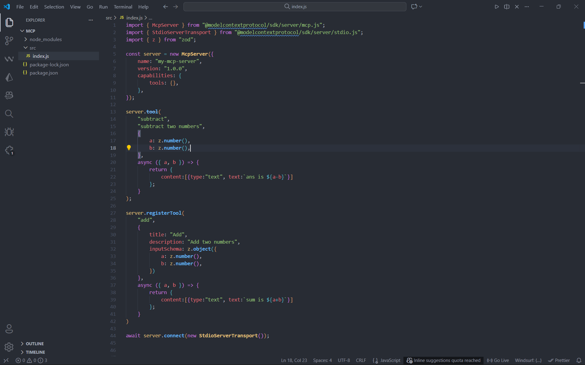

### Step 2. Run the server inside the VScode workspace
1. open VScode command prompt (press ctrl + Shift + p) and search for `MCP: Add Server`

    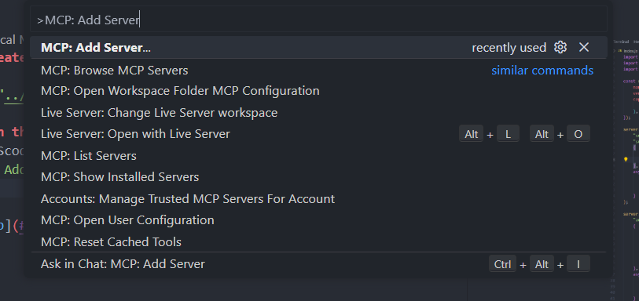

2. Choose your transport type, in our case as we are using local MCP server it will be `stdio`
    - STDIO for local MCP server
    - HTTP for remote MCP server

    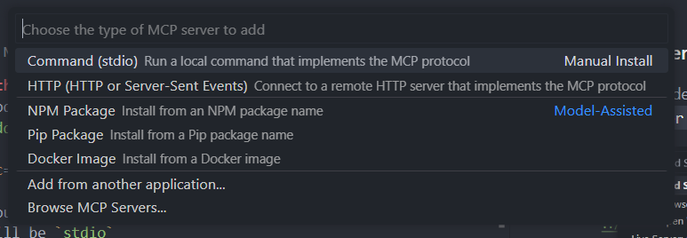

3. provide the command to start the MCP server (to run the MCP server execute the `index.js` file from step 1)

    you can run your MCP server using `package.json` script as will

    ```json
    {
        "scripts": {
            "start": "node src/index.js"
        }
    }
    ```
    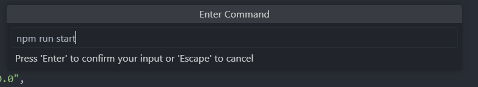

4. Provide the name for you server

    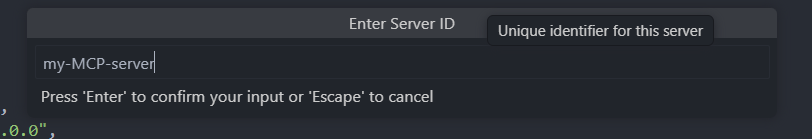

5. Choose the workspace where the server will be available
    - Global: available throughout the VScode
    - Workspace: available only inside the working directory

    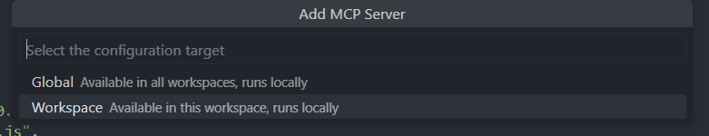

### Step 3. Check the server configuration
after step 2 is complete it will create a `.vscode/mcp.json` file at the root of your project

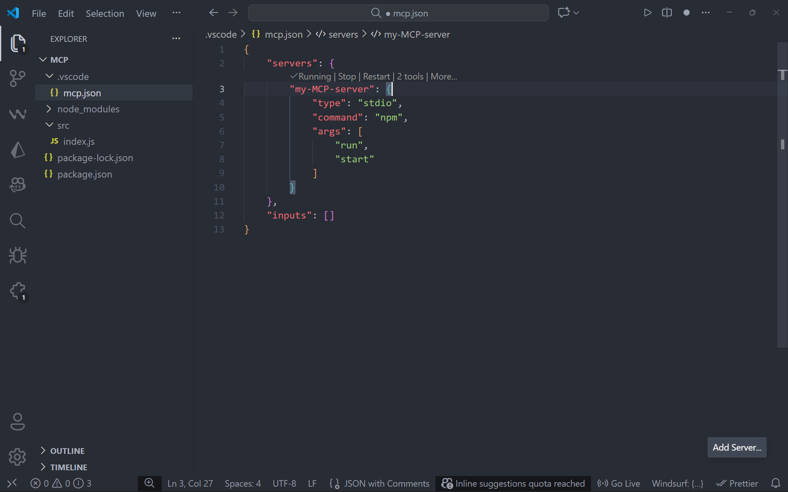

Here:
- `type` = transport type
- `command` + `args` = command to start your MCP server (`npm run start`)
- you can manipulate `command` + `args` if command is incorrect

    ```json
    {
    	"servers": {
    		"my-MCP-server": {
    			"type": "stdio",
    			"command": "node",   
    			"args": [
    				"src/index.js"
    			]
    		}
    	},
    	"inputs": []
    }
    ```
- in above example `command` + `args` = `node src/index.js`

#### You can also add devolvement tools to make devolvement easy

```json
{
	"servers": {
		"my-MCP-server": {
			"type": "stdio",
			"command": "node",   
			"args": [
				"src/index.js"
			],
            "dev": {
                "debug": {
                    "type": "node"
                }
            }
		}
	},
	"inputs": []
}
```
in abode code `dev.debug.type = "node"` will log the node message inside our server

#### Now as the configuration is complete click onto the restart to start the server
 once you click restart and your server stat you'll see following logs

 > this log is because of `dev.debug.type = "node"`

 ```json
 2026-01-06 14:50:03.640 [info] [editor -> server] {"jsonrpc":"2.0","id":1,"method":"initialize","params":{"protocolVersion":"2025-11-25","capabilities":{"roots":{"listChanged":true},"sampling":{},"elicitation":{"form":{},"url":{}},"tasks":{"list":{},"cancel":{},"requests":{"sampling":{"createMessage":{}},"elicitation":{"create":{}}}}},"clientInfo":{"name":"Visual Studio Code","version":"1.107.1"}}}
 2026-01-06 14:50:03.933 [info] [server -> editor] {"result":{"protocolVersion":"2025-11-25","capabilities":{"tools":{"listChanged":true}},"serverInfo":{"name":"my-mcp-server","version":"1.0.0","capabilities":{"tools":{}}}},"jsonrpc":"2.0","id":1}
2026-01-06 14:50:03.933 [info] [editor -> server] {"method":"notifications/initialized","jsonrpc":"2.0"}
2026-01-06 14:50:03.934 [info] [editor -> server] {"jsonrpc":"2.0","id":2,"method":"tools/list","params":{}}
2026-01-06 14:50:03.939 [info] [server -> editor] {"result":{"tools":[{"name":"subtract","description":"subtract two numbers","inputSchema":{"$schema":"http://json-schema.org/draft-07/schema#","type":"object","properties":{"a":{"type":"number"},"b":{"type":"number"}},"required":["a","b"]},"execution":{"taskSupport":"forbidden"}},{"name":"add","title":"Add","description":"Add two numbers","inputSchema":{"$schema":"http://json-schema.org/draft-07/schema#","type":"object","properties":{"a":{"type":"number"},"b":{"type":"number"}},"required":["a","b"]},"execution":{"taskSupport":"forbidden"}}]},"jsonrpc":"2.0","id":2}
```

as you can see this are the JSON-RPC message shear between client and server during [initialization phase](#1-initialization-phase) (first 3) and capability discovery of [operation phase](#2-operation-phase) (last 2)

### Step 4: use github copilot to call this server
1. open the chat interface of github copilot inside vscode (press ctrl + alt + B)

    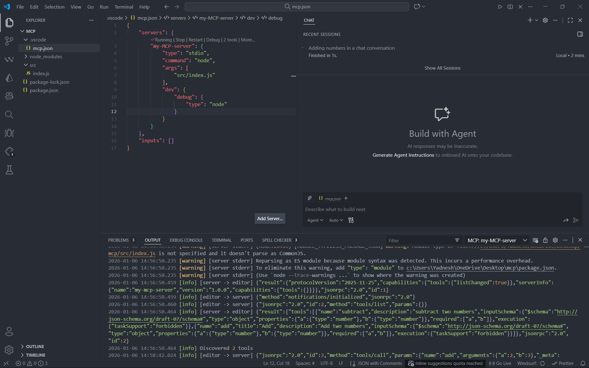


2. inside search bar type `#mcp.json` make sure this refers to `.vscode/mcp.json` file

    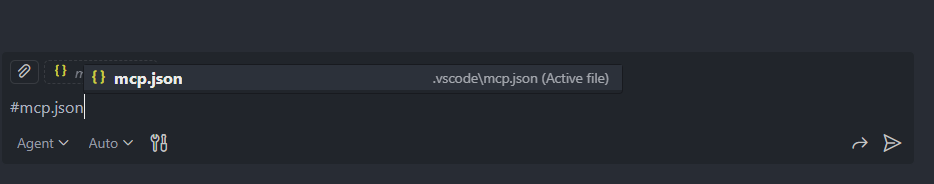

    Or you can directly search your MCP server name

    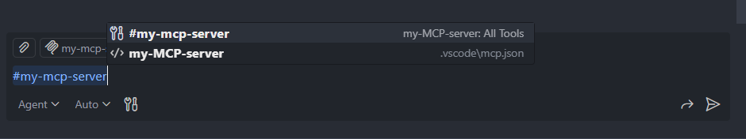

### Call the tool
to call any tool you just have to pass in the query github copilot will automatically decide which tool to call 
> your tool must return the response inside the content array as LLM can only read through the content Array

### Calling a resource
1. click on the add context

    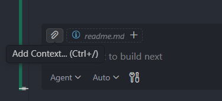

2. Select MCP Resources

    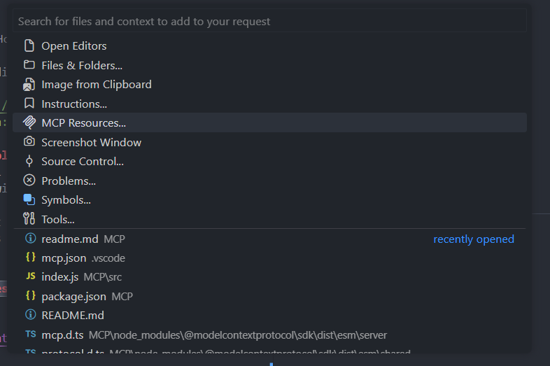

3. You will see the list of all available resources select the resource you want

    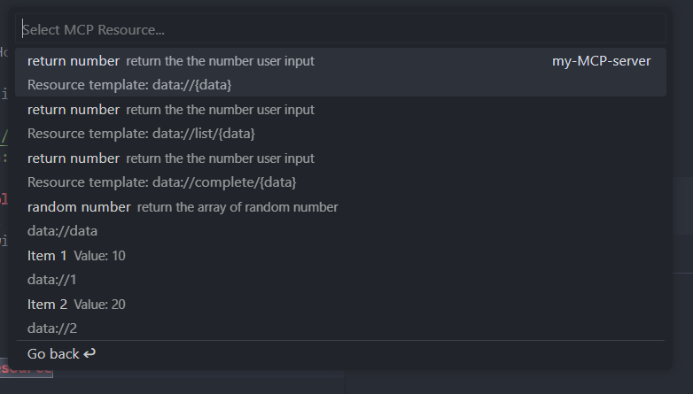

4. You can see its context present inside you chat interface

    

    In above pitcher `data` is the resource context fetch from MCP server

### Calling Prompt
1. press `/` then search you MCP server by its name\
in our case name of MCP server is `my-MCP-server`

    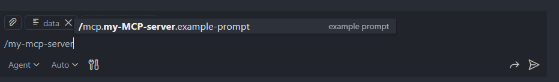

    you will the list of all available prompts here

2. provide the input 

    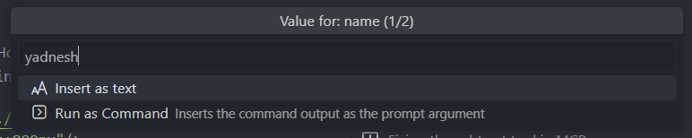

    at the top you'll see which input you are providing, you may need to provide multiple input based on no. of input that prompt take\
    in this case its `name`
3. once you hit the enter after providing input you will see prompt appear in input box of github copilot

    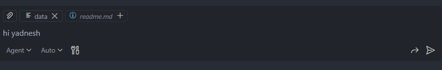


[Go To Top](#content)

---
