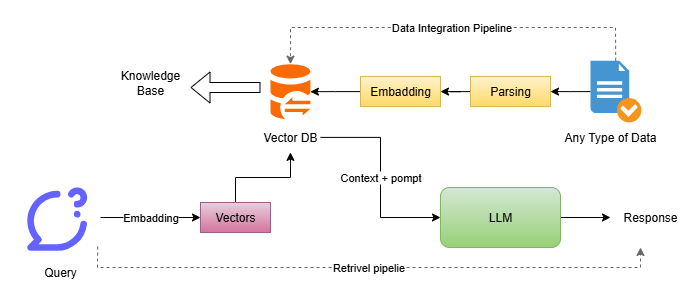
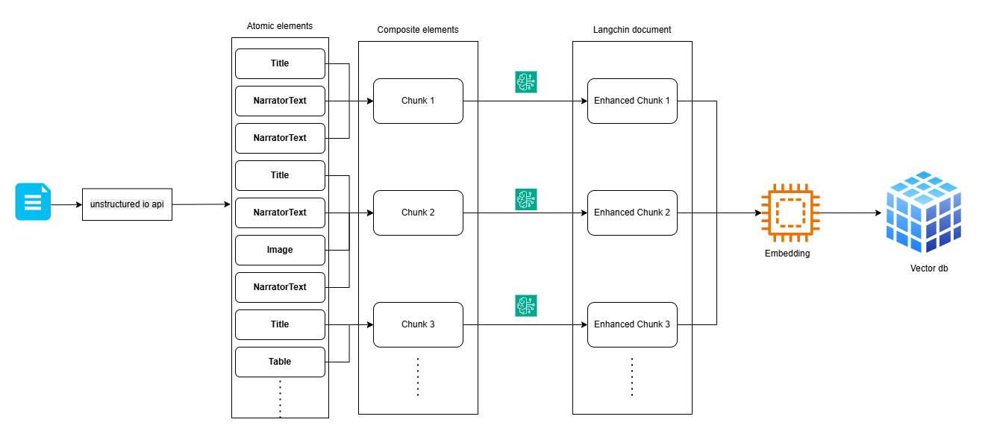

# Content
1. [Introduction](#introduction)
2. [hallucination](#hallucination)
3. [Why RAG Exists](#why-rag-exists)
4. [How Traditional RAG works](#how-traditional-rag-works)
5. [Langchain](../Langchain/Readme.md)
6. [Unstructured Chunking](#unstructured-chunking)
7. [How to Preserve the History?](#how-to-preserve-the-history)
8. [Multi-query RAG](#multi-query-rag)
9. [Reciprocal Rank Fusion (RRF)](#reciprocal-rank-fusion-rrf)
10. [Hybrid Search](#hybrid-search)

> all the code snippets are available at [Langchain](../Langchain/src/) folder

----

# Introduction
- Retrieve Augmented Generator (RAG) is the process of optimizing the output of a LLM, so it references an authoritative knowledge based outside of its training data source before generating a response

- LLM are trained on a vast volume of data and use billions of parameters to generate original output for task like answering questions, translating language, and computing sentence.

- RAG extends the already powerful capabilities of LLM's to specific domain of an organization's internal knowledge base, all without the need to retrain the model

- it is a cost effective approach to improving LLM output so it remain relevant, accurate, and useful in various context

RAG is a technique in AI that combines retrieval of relevant information with generation of answers. 

it helps AI models give more accurate and up-to-date responses by looking up external data rather than relying solely on what they “remember” from training.

Here’s a simple way to visualize it:
1. **Query understanding:** You ask a question, like “What are the latest features of Python 3.12?”
2. **Retrieval:** The system searches a large database or documents to find relevant info.
3. **Generation:** The AI uses the retrieved data to generate a coherent, human-like answer.

> So instead of guessing from memory, it’s like the AI saying:\
>"Let me check my notes, then I’ll give you a detailed answer."

### Example
Question: “Who won the Nobel Prize in Physics in 2024?”

RAG system:
- Retrieves: News articles or databases mentioning the 2024 winner.
- Generates: A clear answer: “The 2024 Nobel Prize in Physics was awarded to … because of their work on …”

> This makes the AI more factual, especially for recent or specialized topics.

[Go To Top](#content)

---

# hallucination
AI hallucination is when an AI makes up answers that sound real but aren’t true. It’s like when someone confidently tells you a story, but they’re just guessing.

### Example:
- You ask: “Who invented the first flying car?”
- AI says: “It was invented by James Wilson in 2010.” → ❌ Wrong, it’s made up.

### Why it happens:
- AI predicts what words should come next, not what is actually true.
- If it doesn’t know the fact, it “fills in the blanks” with something that sounds believable.

### When it happen:
1. **The AI doesn’t have enough information**
    - If it hasn’t seen the fact before, it tries to guess.
    - Example: Asking about a very new technology or a recent event.

2. **The question is vague or ambiguous**
    - The AI fills in details to make the answer sound complete.
    - Example: “Tell me about the scientist who discovered something important.” → It might invent a name.

3. **Complex reasoning or unusual questions**
    - When the AI has to combine multiple pieces of info, it may make mistakes.
    - Example: “Who would win in a chess match between Einstein and Newton?”

4. **Creative or open-ended prompts**
    - If you ask for predictions, stories, or explanations, it may invent facts.
    - Example: “Explain the hidden secrets of Mars colonization in 2025.”
> In short: Hallucination happens when the AI tries to answer without verified knowledge or when the question is tricky or very new.

### Most common scenario when hallucination occur
- let say your model is trained until the data of 2024
- you ask the question related to event that occur in 2025 
- your model will hallucinate and will give some random answer

[Go To Top](#content)

---

# Why RAG Exists
The main reason why RAG exist is as follows
### 1. LLMs can’t store large private data inside themselves
- Large language models have a fixed capacity based on their parameters. They cannot “remember” every private document, company report, or research paper you have. Even if you fine-tune them, there’s a limit to how much data can be incorporated.
- If you ask the AI about some confidential or company-specific data, it won’t know it unless that info is included during training, which is often impractical.
- RAG allows the AI to retrieve data from external sources—like your internal documents, databases, or knowledge bases—at the time of the query. The AI doesn’t have to memorize everything; it just looks up what’s needed.
- **Example**: A company wants the AI to answer questions from its internal policy documents. Instead of training the AI on thousands of pages (expensive and limited), RAG retrieves relevant sections when a question is asked and uses them to generate the answer.

### 2. They hallucinate
- LLMs often produce information that sounds possible but is actually false. This happens because they predict text based on patterns, not verified facts.
- You can’t fully trust answers from a plain LLM, especially for technical, legal, or scientific queries.
- In RAG by retrieving real documents before generating a response, the AI can ground its answers in actual sources, drastically reducing hallucinations.
- **Example**: Without RAG, the AI might say “Dr. X invented a device in 2015” (made-up). With RAG, it first looks up the research papers and then correctly states the inventor and year.

### 3. They can’t access updated information
- LLMs are trained on data available up to a certain cutoff date. Anything new (like the latest technology, news, or scientific discoveries) is unknown to them.
- The AI gives outdated or wrong answers when asked about recent events or developments.
- RAG fetches the latest information from external sources in real time. The model doesn’t need to be retrained to know new facts.
- **Example**: Asking “Who won the Nobel Prize in 2025?” a regular LLM might guess or hallucinate. With RAG, it retrieves the latest announcement and gives the correct answer.

### 4. They are expensive to fine-tune
- Updating a large language model with new knowledge requires retraining or fine-tuning millions/billions of parameters, which is costly and time-consuming.
- Therefor you can’t constantly update the model with new internal or external information.
- Hence in RAG instead of retraining, you just update the documents the AI searches. The AI automatically has access to new knowledge without expensive fine-tuning.
- **Example**: A company releases new product manuals. Instead of retraining the model, RAG indexes the new manuals. Now, AI can answer questions about the new products immediately.

[Go To Top](#content)

---
# How Traditional RAG works



### Data Integration Pipeline

A data integration pipeline is the part of a RAG system responsible for bringing raw documents from different sources into a clean, consistent, searchable format and string it into vector database for retrieval


The raw data can be in any format:
- PDFs
- Word documents
- Websites
- Databases
 CSVs
- Emails
- Logs

But These raw data can’t be used directly, Therefor we perform parsing and embedding

- Parsing: dividing raw data into smaller chunks
- embedding: converting those chunks into vectors
- now this vector can be stored inside the vector db


### Retrieval Pipeline
A data retrieval pipeline is the part of a RAG system responsible for finding the right information from a large collection of documents before the LLM answers your question.

It’s a step-by-step process that takes your query, searches through millions of documents, picks the most relevant ones, and gives them to the LLM so it can answer correctly.

Without this pipeline, the LLM would have nothing to retrieve, and it would rely only on guesswork or old training data.

- in this pipeline we also perform embedding to convert user query into vector
- this vector is used to to retrieve the relevant information form vector db
- this retrieved info is what we called context 
- now this context along with a prompt is given to LLM to generate the response

### Vector db:
A vector database is a special type of database designed to store and search vectors—numerical representations of text, images, audio, or any data that describes meaning or similarity.

In RAG systems, it's the place where all document embeddings are stored so the system can quickly find the most relevant information for a user’s query.

>This vector db is also known as Knowledge base

#### Why vectors?
When you convert text into an embedding (vector), you get something like:
```
[0.12, -0.55, 0.88, 1.02, ...]
```
These numbers capture semantic meaning, so similar texts end up with similar vectors.

by doing this it gets easy to retrieve the similar information from vector db as they are close to each other


[Go To Top](#content)

---
# Unstructured Chunking
Unstructured chunking in LangChain uses the UnstructuredLoader to partition documents into semantic elements (like paragraphs, tables, images) before grouping them into chunks, 

### Example:
look at the following image it shows how different element on each page


### How It Works
- we use unstructured io for partition the file into an atomic element
- we group the element by titles\
from one title element to the next title element all of the element are in one group
- we call each group as CompositeElement which consists of multiple single elements
- each compositeElement is our one chunk

### How to handle Images and tables
- unlike paragraph which we can directly stored in vector db for similarity search, images and table are needed to be handled separately
- in unstructured io we get img in base64 format and table in html format
- we need information in raw text format because embedding is done on text content
- if we perform embedding on base64 img or html table we will decrease the performance of similarity search
- Therefor we use LLM to convert this img_base64 and html table into raw text format 
- now once we get the our whole info in text format we perform embedding

### How to Retrieve the original info
- even though we have updated the information at the time of embedding, we still need to send the original info to LLM 
- to do that we store the original content (base64 img, html tables) in metadata
- at the time of LLM call(when we are answering users query) we send the actual data using this stored metadata 

### Flowchart


>here, each enhanced chunk will carry the AI enhanced text with its original information (original atomic elements) present inside the metadata

### Algorithm
1. perform the partitioning of the original document using unstructured io
2. use `chunk_by_title` to chunk the multiple partitions
3. separate out the original information:
    - text: as a original text
    - img: its base64 format
    - table: its html code
4. use LLM to find the enhanced summary of the original chunk
    > only perform this step if we have img or table inside the combined chunk
5. set page content as enhanced summary (or original text if we didn't compute the enhanced one ) and metadata as separated original information 


## Step 1: perform the partitioning of the original document using 
#### 1. install dependencies
```bash
npm i unstructured-client
```
#### 2: Create the new object of the `unstructured-client`
```js
import { UnstructuredClient } from "unstructured-client";

const client = new UnstructuredClient({
    serverURL: "https://api.unstructuredapp.io/general/v0/general", // partition endpoint
    security: {
        apiKeyAuth: process.env.VALID_API_KEY,
    },
});
```
#### 3: Read your files
```js
import fs from "fs/promises";

const filepath = "./src/UnstructuredChunking/unstructured.pdf"; // from root of the project

const fileBuffer = await fs.readFile(filepath);
const fileName = path.basename(filepath);
```
#### 4: use `unstructured-client` object to perform partitioning
```js
const response = await client.general.partition({
    partitionParameters: {
        files: {
            content: fileBuffer,
            fileName: fileName,
        },
        strategy: Strategy.Auto, 
    },
});
```

## Step 2: use `chunk_by_title` to chunk the multiple partitions
 You can also perform `chunk_by_title` at the time of partitioning
```js
const response = await client.general.partition({
    partitionParameters: {
        files: {
            content: fileBuffer,
            fileName: fileName,
        },
        strategy: Strategy.Auto, 
        chunkingStrategy: "by_title"
    },
});
```
> Use one of the supported strategies to chunk the returned elements after partitioning. When no chunking strategy is specified, no chunking is performed and any other chunking parameters provided are ignored. Supported strategies: `basic`, `by_title`, `by_page`, and `by_similarity`

You can also pass other parameters as follow
```js
const response = await client.general.partition({
    partitionParameters: {
        files: {
            content: fileBuffer,
            fileName: fileName,
        },
        extractImageBlockTypes: ["Image"],  //  use in extracting image blocks as Base64 encoded data stored in element metadata fields 
        strategy: Strategy.Auto, 
        chunkingStrategy: "by_title",
        maxCharacters: 3000,    //  Default: 500
        newAfterNChars: 2400,   // Applies only when the chunking strategy is specified.
        combineUnderNChars: 500,    //combines small chunks until of n characters
    },
});
```
> visit [unstructured io](https://docs.unstructured.io/api-reference/partition/api-parameters) official doc to see all available parameters

Now if you console.log response you'll get array of: 
```
{
  type: 'CompositeElement',
  element_id: 'be54085acc330c8511b046b7d4b44e80',
  text: '3.1 Encoder and Decoder Stacks\n' +
    '\n' +
    'Encoder: The encoder is composed of a stack of N = 6 identical layers. Each layer has two sub-layers. The first is a multi-head self-attention mechanism, and the se
    .
    .
    .
     'Decoder: The decoder is also composed of a stack of N = 6 identical layers. In addition to the two sub-layers in each encoder layer, the decoder inserts a third sub-layer, which performs multi-head attention over the output of the encoder stack. Similar to the encoder, we employ residual connections around each of the sub-layers, followed by layer normalization. We also modify the self-attention sub-layer in the decoder stack to prevent positions from attending to subsequent positions. This masking, combined with fact that the output embeddings are offset by one position, ensures that the predictions for position i can depend only on the known outputs at positions less than i.',
  metadata: {
    filetype: 'application/pdf',
    languages: [ 'eng' ],
    page_number: 2,
    orig_elements: 'eJzsvFmzo8iWJvpXws4rlck8tdl9YBAgQIwSINW9VsY8ChAztPV/v86OyOGczHN7uF1V+dA7LCKE477cfY3fWu7a//pf/5Y26Tttp38rk7/9l29/o9k0JSKE+AnNMvwnAsGynxgqS36imYSiGToJUzz52798+9s7ncIknEIw5r/+Le66ISnbcErHr+cm3Lt5+rciLfNiAi0YhiBgzI/mtUymArSi9Fdr35XtdI7713/FWOZn5l++oQyL/Yz/P//y7dcGFkN+Rs8GGsF/Jv+s4fsQ0PK3cR+n9H3uxSq3tHH7ME7/9t/AiySd0ngqu/bf4iYcx3/rhy4C3ZCfWRwjMNAhK5t02vv0a6x1+9vXktt8DvOvff3r39I2/9s5RQ9a/q2d31E6nLs7iU/pdu70b/jP6LdLG3dJOnwL2+SbmH7/7E5hXI8nyV9muJdT87WwfxQBgSIJQoSA53GE/kTgCP1
    .
    .
    .
    3uLprs1Bvv0guG2bAgWRwuy72IGdArHDQM0Yjcb/jOY/iBwwCejeuz1GXeGz78rKgsh+xvvzvWZB0gH9g44lIBrnVk7DX4oK8gDhKw/owLsvLWOFoVvgnP/CrEhMC8Aj/nF9v6cMTAAugvTMYf5eIb/jbWVNTrxxUgV4G2jOd6pExThLee+V8liZpQC4SUmC'... 77432 more characters,
    filename: 'unstructured.pdf'
  }
}
```
> `orig_elements` is a base64 format of original atomic elements

## Step 3: separate out the original information:
```js
for (const [idx, res] of response.entries()) {
    console.log(`---- Chunk ${idx + 1} ----`);
    const content_types = separate_content_types(res);

    console.log(`Tables Found: ${content_types.table.length}`);
    console.log(`Images Found: ${content_types.image.length}`);
}
```
## Step 4: use LLM to find the enhanced summary of the original chunk
> only perform if we have table or image 
```js
for (const [idx, res] of response.entries()) {
    console.log(`---- Chunk ${idx + 1} ----`);
    const content_types = separate_content_types(res);

    console.log(`Tables Found: ${content_types.table.length}`);
    console.log(`Images Found: ${content_types.image.length}`);

    let EnhancedSummary = null;

    if (content_types.table.length > 0 || content_types.image.length > 0) {
        console.log("Creating AI-Enhanced Summary...");
        try {
            const ai_summary = await create_ai_enhanced_summary(content_types.text, content_types.table, content_types.image);
            EnhancedSummary = ai_summary;
            console.log("AI-Enhanced Summary:", ai_summary);
        } catch (error) {
            console.log("❌ Error generating AI summary:", error);
        }
    }
}
```
## Step 5: set page content as enhanced summary (or original text if we didn't compute the enhanced one ) and metadata as separated original information 
```js
for (const [idx, res] of response.entries()) {
    console.log(`---- Chunk ${idx + 1} ----`);
    const content_types = separate_content_types(res);
    console.log(`Tables Found: ${content_types.table.length}`);
    console.log(`Images Found: ${content_types.image.length}`);

    let EnhancedSummary = null;

    if (content_types.table.length > 0 || content_types.image.length > 0) {
        console.log("Creating AI-Enhanced Summary...");
        try {
            const ai_summary = await create_ai_enhanced_summary(content_types.text, content_types.table, content_types.image);
            EnhancedSummary = ai_summary;
            console.log("AI-Enhanced Summary:", ai_summary);
        } catch (error) {
            console.log("❌ Error generating AI summary:", error);
        }
    }

    langchain_document.push(    // each chunk document
        new Document({
            pageContent: EnhancedSummary ? EnhancedSummary : content_types.text,
            metadata: {
                original_content: {
                    table: [...content_types.table],
                    image: [...content_types.image],
                    text: [...content_types.text],
                },
            },
        })
    );
}
```
## Code:
```js
import { UnstructuredClient } from "unstructured-client";
import { Strategy } from "unstructured-client/sdk/models/shared";
import fs from "fs/promises";
import path from "path";
import "dotenv/config";
import { Document } from "@langchain/core/documents";

const client = new UnstructuredClient({
    serverURL: "https://api.unstructuredapp.io/general/v0/general", // or a hard-coded URL
    security: {
        apiKeyAuth: process.env.VALID_API_KEY,
    },
});

const filepath = "./src/UnstructuredChunking/unstructured.pdf";

const fileBuffer = await fs.readFile(filepath);
const fileName = path.basename(filepath);

const response = await client.general.partition({
    partitionParameters: {
        files: {
            content: fileBuffer,
            fileName: fileName,
        },
        extractImageBlockTypes: ["Image"],
        strategy: Strategy.Auto, 
        chunkingStrategy: "by_title",
        maxCharacters: 3000,
        newAfterNChars: 2400,
        combineUnderNChars: 500,
    },
});

const langchain_document = [];

for (const [idx, res] of response.entries()) {
    console.log(`---- Chunk ${idx + 1} ----`);
    const content_types = separate_content_types(res);
    console.log(`Tables Found: ${content_types.table.length}`);
    console.log(`Images Found: ${content_types.image.length}`);

    let EnhancedSummary = null;

    if (content_types.table.length > 0 || content_types.image.length > 0) {
        console.log("Creating AI-Enhanced Summary...");
        try {
            const ai_summary = await create_ai_enhanced_summary(content_types.text, content_types.table, content_types.image);
            EnhancedSummary = ai_summary;
            console.log("AI-Enhanced Summary:", ai_summary);
        } catch (error) {
            console.log("❌ Error generating AI summary:", error);
        }
    }

    langchain_document.push(
        new Document({
            pageContent: EnhancedSummary ? EnhancedSummary : content_types.text,
            metadata: {
                original_content: {
                    table: [...content_types.table],
                    image: [...content_types.image],
                    text: [...content_types.text],
                },
            },
        })
    );
}
```

## How to separate out original information

#### 1: get each composite element
```js
function separate_content_types(elements) {     // element = single composite element
    
}
```
#### 2: get its `orig_elements` and convert it from base64 to string
```js
import zlib from "zlib";

function separate_content_types(elements) {     // element = single composite element
    const org_element = elements.metadata.orig_elements;    // orig_elements contain each single atomic element in base64 format
    const buffer = Buffer.from(org_element, "base64");
    const decompressed = zlib.inflateSync(buffer);
    const data = JSON.parse(decompressed.toString());   // array of original atomic elements
}
```

#### 3: Check whether we have any image or table inside those atomic element
```js
import zlib from "zlib";

function separate_content_types(elements) {
    const org_element = elements.metadata.orig_elements;
    const buffer = Buffer.from(org_element, "base64");
    const decompressed = zlib.inflateSync(buffer);
    const data = JSON.parse(decompressed.toString());

    data.forEach((element) => {
        if (element.type === "Image") { // make sure this string matches with our response object
            // image present
        }
        if (element.type === "Table") { // make sure this string matches with our response object
            // table present
        }
    });
}
``` 
#### 4: separate out the original text, original base64 image and html table
```js
import zlib from "zlib";

function separate_content_types(elements) {
    const content_types = {
        text: elements.text,    // at the time of chunk by title unstructured io merge the all text content
        table: [],  // contains all the available tables
        image: [],  // contains all the available images
        type: ["text"], // to check whether table/images exit or not
    };

    const org_element = elements.metadata.orig_elements;
    const buffer = Buffer.from(org_element, "base64");
    const decompressed = zlib.inflateSync(buffer);
    const data = JSON.parse(decompressed.toString());

    data.forEach((element) => {
        if (element.type === "Image") {
            content_types.image.push(element.metadata.image_base64);    // make sure this matches with our response object
            content_types.type.push("image");
        }
        if (element.type === "Table") {
            content_types.table.push(element.metadata.text_as_html);    // make sure this matches with our response object
            content_types.type.push("table");
        }
    });

    return content_types;
}
```
## How to generate AI enhanced summary
#### 1: accept the text, table or images
```js
async function create_ai_enhanced_summary(text, table, image) {
    // logic here
}
```
#### 2: initiate your LLM
```js
import { ChatGoogleGenerativeAI } from "@langchain/google-genai";
import "dotenv/config";

async function create_ai_enhanced_summary(text, table, image) {
    const llm = new ChatGoogleGenerativeAI({
        model: "models/gemini-2.5-flash",
        apiKey: process.env.API_KEY,
    });
}
```
#### 3: add text and table into your prompt

```js
import { ChatGoogleGenerativeAI } from "@langchain/google-genai";
import "dotenv/config";

async function create_ai_enhanced_summary(text, table, image) {
    const llm = new ChatGoogleGenerativeAI({
        model: "models/gemini-2.5-flash",
        apiKey: process.env.API_KEY,
    });

    let prompt_text = `${text}`     // adding text 

    if (table.length > 0) {
        table.forEach((tbl, index) => {
            prompt_text += `Table ${index + 1}:\n${tbl}\n`; // adding tables
        });
    }
}
```
#### 4: attach images to the prompt
```js
import { ChatGoogleGenerativeAI } from "@langchain/google-genai";
import "dotenv/config";

async function create_ai_enhanced_summary(text, table, image) {
    const llm = new ChatGoogleGenerativeAI({
        model: "models/gemini-2.5-flash",
        apiKey: process.env.API_KEY,
    });

    let prompt_text = `${text}`;

    if (table.length > 0) {
        table.forEach((tbl, index) => {
            prompt_text += `Table ${index + 1}:\n${tbl}\n`;
        });
    }

    // attaching images
    const message_content = [{ type: "text", text: prompt_text }];
    image.forEach((img) => {
        message_content.push({
            type: "image_url",
            image_url: { url: `data:image/jpeg;base64,${img}` },
        });
    });
}
```
> `data:image/jpeg;base64,${img}` this url generate the png files from base64 format of image
#### 5: invoke your LLM to generate the enhanced summary
```js
import { ChatGoogleGenerativeAI } from "@langchain/google-genai";
import { HumanMessage } from "@langchain/core/messages";
import "dotenv/config";

async function create_ai_enhanced_summary(text, table, image) {
    const llm = new ChatGoogleGenerativeAI({
        model: "models/gemini-2.5-flash",
        apiKey: process.env.API_KEY,
    });

    let prompt_text = `${text}`;

    if (table.length > 0) {
        table.forEach((tbl, index) => {
            prompt_text += `Table ${index + 1}:\n${tbl}\n`;
        });
    }

    const message_content = [{ type: "text", text: prompt_text }];

    image.forEach((img) => {
        message_content.push({
            type: "image_url",
            image_url: { url: `data:image/jpeg;base64,${img}` },
        });
    });

    const message = new HumanMessage({
        content: message_content,
    });

    const result = await llm.invoke([message]);

    return result.content;
}
```
#### 5: do some prompt engineering to get some better results
```js
import { ChatGoogleGenerativeAI } from "@langchain/google-genai";
import "dotenv/config";

async function create_ai_enhanced_summary(text, table, image) {
    const llm = new ChatGoogleGenerativeAI({
        model: "models/gemini-2.5-flash",
        apiKey: process.env.API_KEY,
    });

    let prompt_text = `You are creating a searchable description for document content retrieval.
                CONTENT TO ANALYZE:
                TEXT CONTENT:
                ${text}`;

    if (table.length > 0) {
        prompt_text += "Tables:\n";

        table.forEach((tbl, index) => {
            prompt_text += `Table ${index + 1}:\n${tbl}\n`;
        });

        prompt_text += `
        YOUR TASK:
        Generate a comprehensive, searchable description that covers:
        1. Key facts, numbers, and data points from text and tables
        2. Main topics and concepts discussed  
        3. Questions this content could answer
        4. Visual content analysis (charts, diagrams, patterns in images)
        5. Alternative search terms users might use
        Make it detailed and searchable - prioritize findability over brevity.
        SEARCHABLE DESCRIPTION:
        `;
    }

    const message_content = [{ type: "text", text: prompt_text }];

    image.forEach((img) => {
        message_content.push({
            type: "image_url",
            image_url: { url: `data:image/jpeg;base64,${img}` },
        });
    });

    const message = new HumanMessage({
        content: message_content,
    });

    const result = await llm.invoke([message]);

    return result.content;
}
```
## Complete code
[click here!](../Langchain/src/UnstructuredChunking/Chunking.js) to check out the original code

[Go To Top](#content)

---
# How to Preserve the History?
In basic RAG each query is treated independently. The retriever takes your exact question and search for chunk

In history aware RAG, there's one crucial step: **query reformulation**

Before searching, the system looks at the conversation history and rewrite vague or context-dependent question into clear, standalone question

Human naturally ask follow up question using pronouns, reference based on previous conversation. These question are often unsearchable on their own

### Example
Conversation:
- User: “How does React handle updates?”
- Assistant: explains virtual DOM
- User: “And what about its performance?”

A normal RAG might not know what “its” refers to.\
It might retrieve random performance-related documents.

A history-aware RAG will reformulate the user’s last query into something explicit:\
**“What about React’s virtual DOM performance?”**

### How to do it?
1. every time you ask something to llm save that query into an array
2. pass this history array to llm along with original user query and ask him to modify it for vector db retrieval
3. use this new search query for similarity search on vector db
4. now you can pass this data to LLM to complete your RAG pipeline


### Code:
1. check whether we have chat history or not
```js
if (chatHistory.length > 0) {
    // history exit
} else {
    // history does not exit
}
```
2. if exit the give it to llm and generate the updated search query
```js
let searchQuestion = null;

if (chatHistory.length > 0) {
    // prompt for llm
    const messages = [
        new SystemMessage(
            "Given the chat history, rewrite the new question to be standalone and searchable. Just return the rewritten question."
        ),
        ...chatHistory,
        new HumanMessage(`New question: ${user_question}`),
    ];

    const result = await llm.invoke(messages);
    searchQuestion = result.content.trim(); // updata the search query

    console.log(`Searching for: ${searchQuestion}`);
} else {
    // history does not exit
}
``` 
3. if no history is present then user query will be search params
```js
let searchQuestion = null;

if (chatHistory.length > 0) {
    // prompt for llm
    const messages = [
        new SystemMessage(
            "Given the chat history, rewrite the new question to be standalone and searchable. Just return the rewritten question."
        ),
        ...chatHistory,
        new HumanMessage(`New question: ${user_question}`),
    ];

    const result = await llm.invoke(messages);
    searchQuestion = result.content.trim(); // updata the search query
} else {
    searchQuestion = user_question;
}
```

3. use this `searchQuestion` for data retrieval from vector db
```js
const res = await retrievalPipeline(searchQuestion, 3);
```
4. along with prompt engineering pass this data to llm to answer the users follow up question
```js
const combinedInput = `Based on the following documents, please answer this question: ${user_question}

Documents:
${res.map((doc) => `- ${doc.pageContent}`).join("\n")}

Please provide a clear, helpful answer using only the information from these documents. If you can't find the answer in the documents, say "I don't have enough information to answer that question based on the provided documents."`;

const messages = [
    new SystemMessage("You are a helpful assistant that answers questions based on provided documents and conversation history."),
    ...chatHistory,
    new HumanMessage(combinedInput),
];

const answer = await llm.invoke(messages);
```
5. add this data into chat history
```js
chatHistory.push(new HumanMessage(user_question));
chatHistory.push(new AIMessage(answer.content));
```

### Final Code
```js
import { SystemMessage, HumanMessage, AIMessage  } from "@langchain/core/messages";

const chatHistory = [];

async function ask_question(user_question) {
    let searchQuestion = null;
    if (chatHistory.length > 0) {
        const messages = [
            new SystemMessage(
                "Given the chat history, rewrite the new question to be standalone and searchable. Just return the rewritten question."
            ),
            ...chatHistory,
            new HumanMessage(`New question: ${user_question}`),
        ];

        const result = await llm.invoke(messages);
        searchQuestion = result.content.trim();
    } else {
        searchQuestion = user_question;
    }
    const res = await retrievalPipeline(searchQuestion, 3);
    const combinedInput = `Based on the following documents, please answer this question: ${user_question}

    Documents:
    ${res.map((doc) => `- ${doc.pageContent}`).join("\n")}

    Please provide a clear, helpful answer using only the information from these documents. If you can't find the answer in the documents, say "I don't have enough information to answer that question based on the provided documents."`;

    const messages = [
        new SystemMessage("You are a helpful assistant that answers questions based on provided documents and conversation history."),
        ...chatHistory,
        new HumanMessage(combinedInput),
    ];

    const answer = await llm.invoke(messages);

    chatHistory.push(new HumanMessage(user_question));
    chatHistory.push(new AIMessage(answer.content));

    return answer.content;
}
```
### Complete code
```js
import { Chroma } from "@langchain/community/vectorstores/chroma";
import { SystemMessage, HumanMessage, AIMessage } from "@langchain/core/messages";
import { GoogleGenerativeAIEmbeddings, ChatGoogleGenerativeAI } from "@langchain/google-genai";
import "dotenv/config";

// code to retrieve data from vector db
async function retrievalPipeline(Query, k) {
    const embeddings = new GoogleGenerativeAIEmbeddings({
        model: "text-embedding-004",
        apiKey: process.env.API_KEY,
    });

    const vectorStore = new Chroma(embeddings, {
        collectionName: "a-test-collection",
        chromaCloudAPIKey: process.env.CHROMA_API_KEY,
        clientParams: {
            host: "api.trychroma.com",
            port: 8000,
            ssl: true,
            tenant: process.env.CHROMA_TENANT,
            database: process.env.CHROMA_DATABASE,
        },
    });

    const results = await vectorStore.similaritySearch(Query, k);
    return results;
}

const llm = new ChatGoogleGenerativeAI({
    model: "models/gemini-2.5-flash",
    apiKey: process.env.API_KEY,
});

const chatHistory = [];

async function ask_question(user_question) {
    let searchQuestion = null;
    if (chatHistory.length > 0) {
        const messages = [
            new SystemMessage(
                "Given the chat history, rewrite the new question to be standalone and searchable. Just return the rewritten question."
            ),
            ...chatHistory,
            new HumanMessage(`New question: ${user_question}`),
        ];

        const result = await llm.invoke(messages);
        searchQuestion = result.content.trim();
        console.log(`Searching for: ${searchQuestion}`);
    } else {
        searchQuestion = user_question;
    }
    const res = await retrievalPipeline(searchQuestion, 3);
    const combinedInput = `Based on the following documents, please answer this question: ${user_question}

    Documents:
    ${res.map((doc) => `- ${doc.pageContent}`).join("\n")}

    Please provide a clear, helpful answer using only the information from these documents. If you can't find the answer in the documents, say "I don't have enough information to answer that question based on the provided documents."`;

    const messages = [
        new SystemMessage("You are a helpful assistant that answers questions based on provided documents and conversation history."),
        ...chatHistory,
        new HumanMessage(combinedInput),
    ];

    const answer = await llm.invoke(messages);

    chatHistory.push(new HumanMessage(user_question));
    chatHistory.push(new AIMessage(answer.content));

    return answer.content;
}

const query = "when google was founded?";
const followUpQuestion = "who founded it?";     // have no reference of "it"

console.log("----- Initial Question -----");
const answer = await ask_question(query);
console.log(answer);
console.log("----- Follow-up Question -----");
const followUpAnswer = await ask_question(followUpQuestion);
console.log(followUpAnswer);
```

Output:
```
----- Initial Question -----
Google was founded on September 4, 1998.
----- Follow-up Question -----
Searching for: Who founded Google?
Google was founded by American computer scientists Larry Page and Sergey Brin.
```


[Go To Top](#content)

---


# Multi-query RAG
Multi-query RAG is an advanced technique in Retrieval-Augmented Generation that generates multiple variations of the original user query using an LLM

It retrieves relevant documents for each variant of query in parallel, and then fuses the results (often via Reciprocal Rank Fusion) to improve retrieval coverage and relevance.

### How It Works
An LLM expands a single query into several semantically diverse versions, to address query ambiguity or incompleteness.

Each variant queries retriever independently, yielding broader document recall, after which all the retrieve documents are merged

This differs Multi-query RAG from single-query RAG by reducing the challenges that arises due to using different vocabulary for similar meaning 

### Work flow
1. **Take user question:**\
Receive the original query (and optionally turn it into a clear standalone question).
2. **Generate multiple queries**\
Ask the LLM to produce a few different reformulations/expansions of that question (e.g., 3–5).
3. **Retrieve for each query**\
For each reformulated query, run a top‑k retrieval against your index (vector or hybrid).
4. **Merge results**\
Combine all retrieved documents into one set and rank them (e.g., using Reciprocal Rank Fusion).
5. **Select final context**\
Take the top‑N documents from the merged list as your context.

6. **Call LLM for answer**\
Send the original user question plus the selected documents to the LLM to generate the final answer.

### Code
#### 1. Take user question:
```js
const original_query = "What are the two main components of the Transformer architecture? "
```
#### 2. Generate multiple queries using llm
initiate llm
```js
import { ChatGoogleGenerativeAI } from "@langchain/google-genai";

const llm = new ChatGoogleGenerativeAI({
    model: "models/gemini-2.5-flash",
    apiKey: process.env.API_KEY,
});
```
as we want structured output:
```js
import { z } from "zod";

// what structure your llm should follow to generate the output
const QueryVariationsSchema = z.object({
  queries: z.array(z.string())
});

const llmWithTool = llm.withStructuredOutput(QueryVariationsSchema)
```
write a suitable prompt
```js
const prompt = `Generate 3 different variations of this query that would help retrieve relevant documents:

Original query: ${original_query}

Return 3 alternative queries that rephrase or approach the same question from different angles.`
```
Invoke the llm
```js
const res = await llmWithTool.invoke(prompt)
```
complete code
```js
import "dotenv/config";
import { ChatGoogleGenerativeAI } from "@langchain/google-genai";
import { z } from "zod";

const QueryVariationsSchema = z.object({
  queries: z.array(z.string())
});

const original_query = "What are the two main components of the Transformer architecture? "


const llm = new ChatGoogleGenerativeAI({
    model: "models/gemini-2.5-flash",
    apiKey: process.env.API_KEY,
});

const llmWithTool = llm.withStructuredOutput(QueryVariationsSchema)

const prompt = `Generate 3 different variations of this query that would help retrieve relevant documents:

Original query: ${original_query}

Return 3 alternative queries that rephrase or approach the same question from different angles.`

const res = await llmWithTool.invoke(prompt)
console.log(res)
```
output:
```js
{
  queries: [
    'Identify the primary constituents of the Transformer architecture.',
    'Can you name the two main building blocks of a Transformer model?',
    "What are the fundamental modules comprising the Transformer's design?"
  ]
}
```
#### 3. retrieve the relevant document for all this 3 queries
```js
const allResults = [];

for (const query of res.queries) {
    const similaritySearchResults = await vectorStore.similaritySearch(query, 3);
    allResults.push(similaritySearchResults);
}
console.log("All Similarity Search Results:", allResults);
```
output:
```
allResults = [
    [Doc1, Doc2, Doc3],  ← Query 1 results
    [Doc2, Doc1, Doc6],  ← Query 2 results  
    [Doc8, Doc2, Doc9]   ← Query 3 results
]
```
### Complete code
```js
import "dotenv/config";
import { ChatGoogleGenerativeAI, GoogleGenerativeAIEmbeddings } from "@langchain/google-genai";
import { Chroma } from "@langchain/community/vectorstores/chroma";
import { z } from "zod";

const QueryVariationsSchema = z.object({
    queries: z.array(z.string()),
});

const original_query = "What are the two main components of the Transformer architecture? ";

const llm = new ChatGoogleGenerativeAI({
    model: "models/gemini-2.5-flash",
    apiKey: process.env.API_KEY,
});

const llmWithTool = llm.withStructuredOutput(QueryVariationsSchema);

const prompt = `Generate 3 different variations of this query that would help retrieve relevant documents:

Original query: ${original_query}

Return 3 alternative queries that rephrase or approach the same question from different angles.`;

const res = await llmWithTool.invoke(prompt);
console.log(res);

const embeddings = new GoogleGenerativeAIEmbeddings({
    model: "text-embedding-004",
    apiKey: process.env.API_KEY,
});

const vectorStore = new Chroma(embeddings, {
    collectionName: "a-test-collection",
    chromaCloudAPIKey: process.env.CHROMA_API_KEY,
    clientParams: {
        host: "api.trychroma.com",
        port: 8000,
        ssl: true,
        tenant: process.env.CHROMA_TENANT,
        database: process.env.CHROMA_DATABASE,
    },
});

const allResults = [];

for (const query of res.queries) {
    const similaritySearchResults = await vectorStore.similaritySearch(query, 3);
    allResults.push(similaritySearchResults);
}
console.log("All Similarity Search Results:", allResults);
```


[Go To Top](#content)

---
# Reciprocal Rank Fusion (RRF)
Reciprocal Rank fusion (RRF) is a method that combine multiple ranked chunk list by giving each chunk a score on its position across all lists

### Ranked chunk
In RAG (Retrieval-Augmented Generation), ranking is the step where the system sorts the retrieved documents according to how relevant they are to the user’s query.

A ranked chunk is simply a retrieved text chunk that has been scored and sorted by relevance to the user’s query during a RAG pipeline.

**example**

When you do retrieval, you usually get many chunks from your vector store.

Like:
- Chunk A
- Chunk B
- Chunk C
- Chunk D

Each chunk gets a relevance score (from cosine similarity or a reranker model).

After scoring, you get something like:

| Chunk   | Score |
| ------- | ----- |
| Chunk C | 0.91  |
| Chunk A | 0.87  |
| Chunk D | 0.55  |
| Chunk B | 0.31  |


These are now called ranked chunks — the list is sorted from most relevant to least relevant.

Only the top-ranked chunks (e.g., top 2–5) are passed into the LLM context.
> Better ranking → better answers.


### Formula

$${RRF\ score} = \sum \left(\frac{1}{k + rank\ position}\right)$$

- k = constant (in most of the cases it is assume to be 60)
- rank position = position of the chunk in the query result

### Example

Query: “How to connect MongoDB using Node.js?”

Retriever 1 (BM25)
1. C1 – Express + MongoDB example
2. C4 – MongoDB connection URI doc
3. C3 – Mongoose basics

Retriever 2 (Embeddings)
1. C3 – Mongoose basics
2. C1 – Express + MongoDB example
3. C2 – React frontend

Apply RRF (k = 0)

| Chunk | BM25 Rank | Embedding Rank | RRF Score for BM25  | RRF Score for Embeddings | Final RRF score
| ----- | --------- | -------------- | ------------------- | ----- | --- 
| C1    | 1         | 2              | 1/1 = 1  | 1/2 = 0.5 | 1 + 0.5 = 1.5
| C2    | —         | 3              |   —         | 1/3 = 0.33 | 0.33
| C3    | 3         | 1              | 1/3 = 0.33  |1/1 = 1 | 0.33 + 1 = 1.33
| C4    | 2         | —              | 1/2 = 0.5 | — | 0.5


Final Ranking:
1. C1 → best combined score
2. C3 → strong, but slightly less
3. C4 → only one list but still somewhat relevant
4. C2 → weakest relevance
> as C1 > C3 > C4 > C2

### Significance of k = 60 and k = 0
The constant k in Reciprocal Rank Fusion is used to control how much the rank position affects the final score.

It’s not a magic number — it’s a practical default chosen because it works well across many retrieval tasks.

we generally keep it as 60 (k=60) here are some reasons why:

#### It prevents the top ranks from dominating too much
If k were small (like 1 or 5), the first few ranks would get massive score differences:

- rank 1 → 1/(small number) = big score
- rank 2 → much smaller
- rank 3 → tiny

That would mean only the top-1 or top-2 results matter, and everything else is ignored.

Setting k = 60 smooths the curve:
- rank 1 → 1/61
- rank 2 → 1/62
- rank 10 → 1/70
- rank 50 → 1/110

All of these are close enough that multiple retrievers can influence the result.

#### It balances sparse and dense retrievers

BM25 and Embedding retrievers often rank documents very differently.\
With k = 60:
- A doc at rank 1 in BM25
- and rank 30 in Embeddings

…can still combine to a reasonable total score.

If k were too small, rank 30 would be almost useless.

#### It handles long rankings safely

Many retrieval systems return 100, 200, or 1000 chunks.\
With k = 60, even ranks like 200 still contribute a non-zero, but very small amount.

This avoids ignoring long-tail evidence entirely.

#### It’s a widely tested default

RRF came from IR (Information Retrieval) research.\
Through benchmarks on TREC datasets, researchers found:

k = 60 consistently gave strong results across domains

So most libraries and papers copy this default.

You can tune it, but 60 is the usual sweet spot.

[Go To Top](#content)

---
# Hybrid Search
Hybrid search is an information retrieval approach that combines traditional keyword (lexical/sparse) search with semantic (vector/dense) search to produce more accurate and context-aware results than either method alone.

It combine:
### 1. Keyword search
Keyword search, also called lexical or sparse search, is a traditional information retrieval method that finds documents containing exact keywords or phrases from the user's query, using techniques like inverted indexes and scoring models such as BM25 or TF-IDF.

Example: Searching for "python list comprehension" in documentation or code repositories.

Now:
1. User enters keywords (e.g., "python list comprehension")
2. Query breaks into terms ("python", "list", "comprehension")
3. Inverted index lookup - find all docs containing each term
4. Score each document using BM25/TF-IDF:
    - TF: How often term appears in doc
    - IDF: How rare term is across corpus
5. Rank and sort docs by combined score
6. Return top results (exact phrase matches rank higher)


### 2. Vector search
Vector search (often called semantic search) is a retrieval method that finds “meaningfully similar” items by comparing vector embeddings instead of matching raw keywords.

Example: Searching for "python list comprehension" in documentation or code repositories.

1. Embed the query\
Convert "python list comprehension" → vector [0.23, -0.15, 0.87, ...] using embedding model (e.g., OpenAI text-embedding-ada-002)
2. Embed documents (pre-computed)\
Each doc chunk already has vectors stored in vector DB (Chroma, Pinecone, etc.)
3. Compute similarity\
For each doc vector, calculate cosine similarity:
4. Find nearest neighbors\
Use ANN index (HNSW, IVF) to quickly find top-k closest vectors (e.g., top-10 most similar)
5. Rank and return
    - Sort by similarity score (1.0 = identical meaning, 0 = unrelated)
    - Returns docs about list comprehensions, array iteration, even if they say "list iteration syntax"

### Why hybrid search is better?
Hybrid search is often better because it combines the strengths of keyword search (exact matching, filters) and vector search (semantic matching), giving higher recall and precision across many query types.

#### Why it’s stronger than keyword-only
- Keyword search is great when the user knows the exact terms, codes, or product names, but it fails on synonyms, paraphrases, and vague natural language queries.​
- Hybrid search still uses those exact matches but also brings in semantically related content via vectors, so relevant results appear even when the wording does not match exactly.

#### Why it’s stronger than vector-only
- Pure vector search can surface semantically similar but “legally wrong” or off-domain results if strict terms (IDs, regulation numbers, error codes) must match exactly.​
- Hybrid search can boost or filter by exact keyword conditions while ranking by semantic similarity, which improves control, explainability, and relevance for production apps like RAG, e‑commerce, and enterprise search

### Example
Searching for "python list comprehension" in documentation or code repositories.

Now:

1. User sends query\
Input: `"python list comprehension"`.

2. Keyword search branch
    - Break query into tokens: "python", "list", "comprehension".
    - Look up these terms in an inverted index and score documents with something like BM25/TF‑IDF.
    - Get a ranked list of docs based on exact/phrase matches.
3. Vector (semantic) search branch
    - Convert the query text into an embedding vector.
    - Compare this vector to precomputed document embeddings (nearest‑neighbor search).
    - Get a ranked list of semantically similar docs (including ones that say “iterate over a list”, “loop over array”, etc., even if they don’t use the exact phrase).
4. Combine the two result lists
    - Take the keyword list and the vector list and fuse them into one list.
    - A common way is to use a rank-based method (e.g., give each doc points based on how high it appears in each list, then sum and sort).
5. Return final ranked results
    - Strongly match the exact phrase “python list comprehension”.
    - Also include highly relevant docs that explain the same concept with different wording.

### Code
1. vector search retriever
```js
import "dotenv/config";
import { GoogleGenerativeAIEmbeddings } from "@langchain/google-genai";
import { Chroma } from "@langchain/community/vectorstores/chroma";

const embeddings = new GoogleGenerativeAIEmbeddings({
    model: "text-embedding-004",
    apiKey: process.env.API_KEY,
});

const vectorStore = new Chroma(embeddings, {
    collectionName: "a-test-collection",
    chromaCloudAPIKey: process.env.CHROMA_API_KEY,
    clientParams: {
        host: "api.trychroma.com",
        port: 8000,
        ssl: true,
        tenant: process.env.CHROMA_TENANT,
        database: process.env.CHROMA_DATABASE,
    },
});

await vectorStore.addDocuments(documents, { ids: documents.map((doc) => doc.metadata.id) });

const vectorRetriever = vectorStore.asRetriever( {k: 3} );
```
2. keyword search retriever
```js
import { BM25Retriever } from "@langchain/community/retrievers/bm25";

const bm25retriever = BM25Retriever.fromDocuments(documents, {k: 3});
```
3. hybrid search retriever
```js

const hybridRetriever = new EnsembleRetriever({
  retrievers: [vectorRetriever, bm25retriever],
  weights: [0.7, 0.3]  // 70% vector, 30% BM25/keyword
});
```

### Complete code
```js
import "dotenv/config";
import { GoogleGenerativeAIEmbeddings } from "@langchain/google-genai";
import { BM25Retriever } from "@langchain/community/retrievers/bm25";
import { Chroma } from "@langchain/community/vectorstores/chroma";
import { EnsembleRetriever } from "@langchain/classic/retrievers/ensemble";

// some sample text chunks
const chunks = [
    "Microsoft acquired GitHub for 7.5 billion dollars in 2018.",
    "Tesla Cybertruck production ramp begins in 2024.",
    "Google is a large technology company with global operations.",
    "Tesla reported strong quarterly results. Tesla continues to lead in electric vehicles. Tesla announced new manufacturing facilities.",
    "SpaceX develops Starship rockets for Mars missions.",
    "The tech giant acquired the code repository platform for software development.",
    "NVIDIA designs Starship architecture for their new GPUs.",
    "Tesla Tesla Tesla financial quarterly results improved significantly.",
    "Cybertruck reservations exceeded company expectations.",
    "Microsoft is a large technology company with global operations.",
    "Apple announced new iPhone features for developers.",
    "The apple orchard harvest was excellent this year.",
    "Python programming language is widely used in AI.",
    "The python snake can grow up to 20 feet long.",
    "Java coffee beans are imported from Indonesia.",
    "Java programming requires understanding of object-oriented concepts.",
    "Orange juice sales increased during winter months.",
    "Orange County reported new housing developments.",
];

// convert them into langchain documents
const documents = chunks.map((chunk, index) => ({
    pageContent: chunk,
    metadata: { id: (index + 1).toString() },
}));

const embeddings = new GoogleGenerativeAIEmbeddings({
    model: "text-embedding-004",
    apiKey: process.env.API_KEY,
});

const vectorStore = new Chroma(embeddings, {
    collectionName: "a-test-collection",
    chromaCloudAPIKey: process.env.CHROMA_API_KEY,
    clientParams: {
        host: "api.trychroma.com",
        port: 8000,
        ssl: true,
        tenant: process.env.CHROMA_TENANT,
        database: process.env.CHROMA_DATABASE,
    },
});

await vectorStore.addDocuments(documents, { ids: documents.map((doc) => doc.metadata.id) });

const vectorRetriever = vectorStore.asRetriever({ k: 3 });

const bm25retriever = BM25Retriever.fromDocuments(documents, { k: 3 });

const hybridRetriever = new EnsembleRetriever({
    retrievers: [vectorRetriever, bm25retriever],
    weights: [0.7, 0.3], // 70% vector, 30% BM25/keyword
});

const test_query = "purchase cost 7.5 billion";

const retrieved_chunks = await hybridRetriever.invoke(test_query);

console.log("Retrieved Chunks:", retrieved_chunks);
```
Output:
```
Retrieved Chunks: [
  Document {
    pageContent: 'Microsoft acquired GitHub for 7.5 billion dollars in 2018.',
    metadata: { id: '1' },
    id: '1'
  },
  Document {
    pageContent: 'The tech giant acquired the code repository platform for software development.',
    metadata: { id: '6' },
    id: '6'
  },
  Document {
    pageContent: 'Cybertruck reservations exceeded company expectations.',
    metadata: { id: '9' },
    id: '9'
  },
  {
    pageContent: 'Tesla Cybertruck production ramp begins in 2024.',
    metadata: { id: '2' }
  },
  {
    pageContent: 'Google is a large technology company with global operations.',
    metadata: { id: '3' }
  }
]
```


[Go To Top](#content)

---
